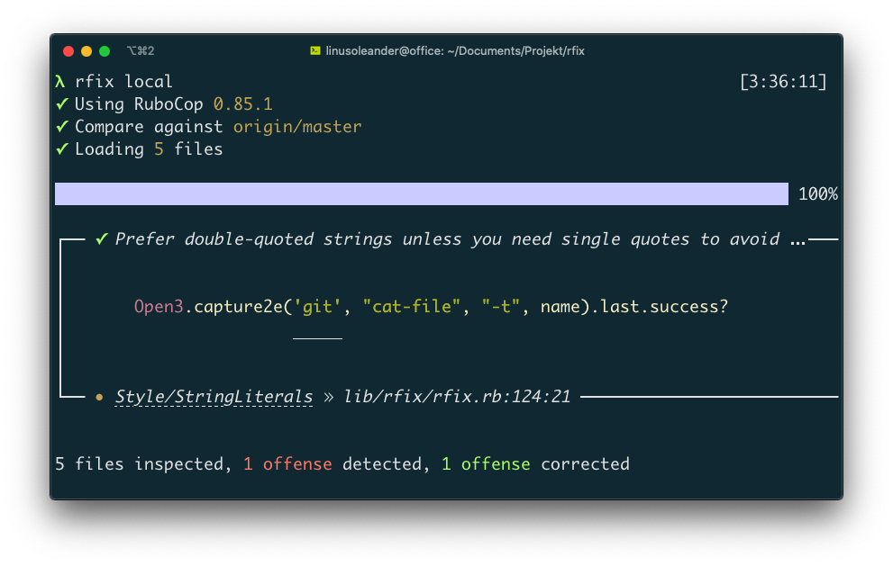

# :bug: Rfix [](https://travis-ci.org/oleander/rfix-rb) [](https://rubygems.org/gems/rfix)

RuboCop CLI that only lints and auto-fixes code you committed by utilizing `git-log` and `git-diff`. Rfix CLI makes it possible to lint (`rfix lint`) and auto-fix (`rfix local|origin|branch`) code changes since a certain point in history. You can auto-fix code committed since creating the current branch (`rfix origin`) or since pushing to upstream (`rfix local`).

Includes a RuboCop formatter with syntax highlighting and build in hyperlinks for offense documentation.

Holds the same CLI arguments as RuboCop. Run `rfix --help` for a complete list or `rfix` for supported commands. Here are a few examples to get you started:

- `rfix local` Auto-fixes commits not yet pushed to upstream
- `rfix origin` Auto-fixes commits between `HEAD` and origin branch
- `rfix lint` Lints commits and untracked files not yet pushed to upstream



## Installation

``` shell
$ gem install rfix [--pre]
```

## Help

``` shell
$ rfix branch "branch" # Fix changes made between HEAD and <branch>
$ rfix origin          # Fix changes made between HEAD and origin branch
$ rfix local           # Fix changes not yet pushed to upstream branch
$ rfix info            # Display runtime dependencies and their versions
$ rfix all             # Fix all files in this repository (not recommended)
$ rfix lint            # Shortcut for 'rfix local --dry --untracked'
$ rfix                 # Displays this list of supported commands
```

### Arguments

- `--dry` Turns off RuboCops autofix feature (read-only mode)
- `--help` Displays RubyCops and Rfix supported arguments
- `--list-files` List all files being passed to RubyCop
- `--untracked` Include files not tracked by git
- `--config` Configuration file, defaults to `.rubocop.yml`

## Development

### Setup

1. Download repository
  - `$ git clone https://github.com/oleander/rfix-rb`
  - `$ cd rfix-rb`
2. Downloads fixtures and run time dependencies
  - `$ make dir fetch`
  - `$ bundle install`

### Install from repository

``` shell
$ bundle exec rake install
```

### Run tests

``` shell
$ bundle exec rake spec
```

## Overcommit

Add the following to your `.overcommit.yml`, then run `overcommit --install` and `overcommit --sign pre-commit`. Lints commits not yet pushed to your upstream branch whenever `git commit` is ran.

``` yaml
PreCommit:
  RFix:
    enabled: true
    command: ["rfix", "lint"]
    description: "Lint unchanged commits using RuboCop"
    parallelize: true
```

### From scratch

1. `gem install overcommit rfix`
2. `curl https://raw.githubusercontent.com/oleander/rfix-rb/master/resouces/overcommit.yml > .overcommit.yml`
3. `overcommit --install`
4. `overcommit --sign pre-commit`

Run `overcommit --run` to test the new hook.

## Contributing

Bug reports and pull requests are welcome on GitHub at https://github.com/oleander/rfix.

## License

The gem is available as open source under the terms of the [MIT License](https://opensource.org/licenses/MIT).
